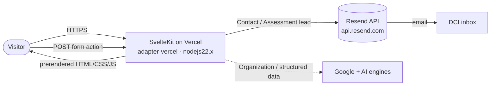

# Design Doc — Deeper Connection Initiative Website

| | |
|---|---|
| **Status** | Draft |
| **Author** | DCI / kolynzb |
| **Last updated** | 2026-07-20 |
| **Scope** | The `deeperconnectioninitiative.com` marketing + lead-capture website (`web/`) |

> Format: Google-style engineering design doc (Context & scope · Goals & non-goals · The actual design · Alternatives considered · Cross-cutting concerns). The visual design *system* (tokens, components) lives separately in [`.interface-design/system.md`](.interface-design/system.md).

---

## Context and scope

DCI Wellness is a Uganda-based mental-wellness organisation. The website is its primary top-of-funnel surface: it has to move three audiences — individuals/families, organisational decision-makers, and prospective Community Champions — from curiosity to a concrete action (buy a toolkit, book a call, apply for training, complete the Blueprint Assessment).

The site is a **content-heavy marketing site with two lightweight lead-capture flows**. It is not an app: there are no user accounts, no persistent database, and no authenticated area today (`/signin`, `/signup` are present as routes but are marketing/placeholder, not a live auth system). The engineering problem is therefore: *serve fast, credible, SEO-strong marketing content, and reliably capture two kinds of leads without standing up a backend.*

This doc describes the system as currently built and the decisions behind it.

## Goals and non-goals

**Goals**
- Fast, SEO-strong static delivery of ~20 marketing routes.
- Two reliable lead-capture flows (Contact enquiry, Blueprint Assessment) that email DCI, degrade gracefully, and never lose the visitor's progress.
- Strong entity/structured-data signals for Google + AI answer engines.
- A single, enforceable visual design system (see `system.md`).
- Zero-maintenance hosting — no database, no server to babysit.

**Non-goals**
- User accounts, authentication, or a member area (routes exist but are not in scope here).
- Storing leads in a database or CRM (email delivery is the system of record today).
- A CMS — content is authored directly in Svelte components.
- Internationalisation / multi-locale (English only for now).
- E-commerce / payment processing.

## The actual design

### System-context diagram

### Rendering & routing model
- **Framework:** SvelteKit + **Svelte 5 (runes)**, built with Vite, deployed via **`@sveltejs/adapter-vercel`** (`runtime: 'nodejs22.x'`).
- **Routing:** file-based under `src/routes/`. ~20 marketing pages (`/`, `/platform`, `/toolkit`, `/trainings`, `/champions`, `/connection-miles`, `/events`, `/partners`, `/volunteering`, legal pages, etc.).
- **Rendering:** marketing pages are static/prerenderable; the only server surfaces are the two form-action endpoints and `sitemap.xml/+server.ts`.
- **Composition:** pages assemble from `src/lib/components/sections/*` and `pages/sections/*`; shared chrome in `components/layout/`; primitives in `components/ui/` (shadcn-svelte on **bits-ui**).

### APIs / server actions
Two SvelteKit form actions, structurally identical and both delivering through **Resend**:

1. **`/contact` → `+page.server.ts`** — validates name/email/message, then POSTs to `api.resend.com/emails`.
2. **`/performance/assessment` → `+page.server.ts`** — captures the lead *plus* a computed Blueprint snapshot, emails DCI a copy.

Shared design decisions in both actions:
- **Honeypot field** (`company` / `company_url`) — silently returns success for bots.
- **Server-side validation** with field-level error return via `fail(400, {errors, values})`; values are echoed back so the form re-renders populated.
- **HTML escaping** (`escapeHtml`) on every user value before it enters the email body.
- **Graceful config degradation:** if `RESEND_API_KEY` is unset, the action logs a loud warning and returns success so the flow works in dev.
- **`reply_to`** set to the visitor's email so DCI can reply directly.

### Data models
No database. The only domain model is the **Blueprint Assessment** (`src/routes/performance/assessment/assessment.ts`):
- **5 facets** (`think`, `recover`, `decide`, `communicate`, `lead`), each scored **1–5**.
- **3 bands** (`strength`, `steady`, `redesign`) via `bandFor(score)`; per-facet `interpretations`.
- **Scoring is client-side** (`scoreAnswers`); the server action only *records* the computed snapshot for the internal email. The visitor always sees their result even if delivery fails.

### SEO & structured data
Centralised config drives entity signals:
- `src/lib/config/site.ts` — canonical site metadata, contacts, `social` → schema `sameAs`.
- `src/lib/config/seo.ts` — titles, OpenGraph, canonical.
- `src/lib/config/structured-data.ts` — JSON-LD (Organization).
- `sitemap.xml/+server.ts` — generated sitemap.

### Visual design system
Governed by [`.interface-design/system.md`](.interface-design/system.md): DCI brand tokens (teal/burgundy/cream/sand/paper/clay), 4px spacing grid, **borders-first depth** (only two `shadow-dci-*` lift tokens), generous radii (`rounded-full`/`2xl`/`xl`), Fraunces headings / Outfit body, house easing `cubic-bezier(0.16,1,0.3,1)`, reduced-motion-safe animation. Tokens are defined in the Tailwind v4 `@theme` block in `src/routes/layout.css`.

### Degree of constraint
Deliberately **unconstrained on content, constrained on system**: page copy/layout is free-form Svelte, but color, spacing, depth, and motion must come from the design-system tokens (enforceable via `/audit`). Delivery infra is fixed (Vercel + Resend).

## Alternatives considered

| Decision | Chosen | Alternatives & why not |
|---|---|---|
| Backend for leads | **Resend email, no DB** | A DB/CRM adds ops + privacy surface for a low volume of leads; email is sufficient and zero-maintenance. Revisit if volume or follow-up analytics demand it. |
| Assessment scoring | **Client-side compute** | Server-side scoring gains nothing (no persistence) and would block the visitor's result on a network round-trip. |
| Rendering | **SvelteKit prerender + adapter-vercel** | A pure SSG (Astro/Eleventy) can't host the two dynamic form actions as cleanly; a full SSR app is overkill for mostly-static content. |
| UI primitives | **shadcn-svelte / bits-ui** | Hand-rolling accessible menus/sheets is error-prone; a heavier component lib would fight the bespoke brand styling. |

## Cross-cutting concerns

- **Security:** honeypot anti-spam, strict server-side validation, HTML-escaping of all user input in emails, secrets only in private env (`$env/dynamic/private`), no secrets client-side. *Gap:* no rate-limiting on form actions — acceptable at current volume, revisit if abused.
- **Privacy:** minimal PII (name/email/phone/role + self-reported assessment scores), transmitted to DCI via Resend, not stored server-side. Legal routes (`/privacy`, `/terms`, `/accessibility`) exist.
- **Accessibility:** skip-link in `+layout.svelte`, accessible primitives via bits-ui, focus-visible rings in the design system, `prefers-reduced-motion` fully honoured.
- **Performance:** static delivery on Vercel edge; GSAP + scroll-reveal (`lib/actions/reveal.ts`) are the main JS cost; `will-change` used deliberately on animated elements.
- **Observability:** `console.warn`/`console.error` on delivery failures surface in Vercel logs. *Gap:* no structured error tracking (e.g. Sentry) — a candidate if lead delivery reliability becomes critical.
- **Theming:** light + dark via `mode-watcher`; light mode is canonical, dark mode is a warm re-expression, not an inversion.
